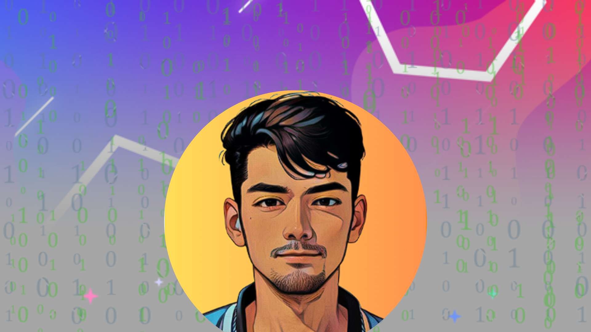

  

<h2>Heyy There, I'm Abin Skaria👋! </h2>

<em>CSE Student at <a href="https://ceconline.edu/">College Of Engineering Chengannur</a> 
</em>

</h3>

  I'm a <strong>student</strong>, <strong>developer</strong>, and an aspiring <strong>software engineer</strong>. I am ✨ passionate ✨ about computer science, and I have a strong love for mathematics. I'm making projects or learning something new just about every day. You can find my coolest projects here on my GitHub :)

  
  
  
  
  
  
  
  
  
  

<h3>📈 Status</h3>

&nbsp;

              
              

 <a href="https://www.linkedin.com/in/abin-skaria-85140920b">LinkedIn</a> · <a href="mailto:abinskaria2802@gmail.com">Email</a> 

<!--
**Abin-28/Abin-28** is a ✨ _special_ ✨ repository because its `README.md` (this file) appears on your GitHub profile.

Here are some ideas to get you started:

- 🔭 I’m currently working on ...
- 🌱 I’m currently learning ...
- 👯 I’m looking to collaborate on ...
- 🤔 I’m looking for help with ...
- 💬 Ask me about ...
- 📫 How to reach me: ...
- 😄 Pronouns: ...
- ⚡ Fun fact: ...
-->
